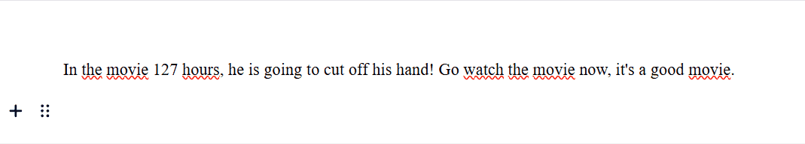
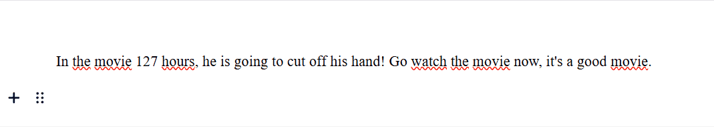

# EditorJS Inline Spoiler Plugin


Adds a Inline Spoiler Marker for [Editor.js](https://editorjs.io). This plugins styling is easily customizeable (see further below).


## Installation

Get the package

```shell
npm install editorjs-inline-spoiler
```

Include module at your application

```javascript
import EditorJSInlineSpoiler from "editorjs-inline-spoiler"
```

## Usage
Add the plugin to your EditorJS instance:

```javascript
const editor = new EditorJS({
  holder: "your-holder",
  tools : {
    InlineSpoiler: EditorJSInlineSpoiler
  }
});
```

or in React with [react-editor-js](https://github.com/Jungwoo-An/react-editor-js).

```javascript
export const ReactEditor = () => {
  const ReactEditorJS = createReactEditorJS()

  return (
    <ReactEditorJS
      defaultValue={....}
      tools       ={{
        InlineSpoiler: EditorJSInlineSpoiler
      }}
    />
  )
}
```


## Style customization
You can customize the spoiler style by overwriting the `editorjs-inline-spoiler` class. The plugin uses data-attributes to manage state. You can hook into these via CSS and style the show/hide styles too! Here is an example:

```css
.editorjs-inline-spoiler {
  border-radius: 0px !important;
}

/* Show State */
.editorjs-inline-spoiler[data-show="true"] {
  color           : hsla(35, 100%, 70%, 1) !important;
  background-color: hsla(35, 100%, 6%, 1) !important;
}

/* Hide State */
.editorjs-inline-spoiler[data-show="false"] {
  background-color: hsla(35, 100%, 70%, 1) !important;
  color           : hsla(35, 100%, 70%, 0) !important;
}
```



## Development

```shell
npm run install
npm run watch
```

Open a pull request if you spot any bugs!

## License

This plugin is licensed under an MIT license.

## Acknowledgements

Made with 💛 by [Kaan Aksu](https://github.com/Stuhl)